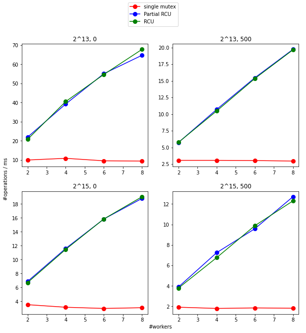
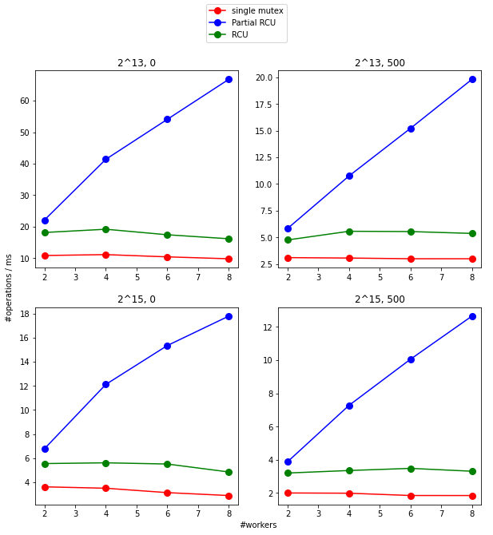

# RCU Hash Table

## Introduction to RCU

The concept of Read-copy update (RCU) is already thoroughly explained in many online articles. Some very good sources are listed here: http://www2.rdrop.com/users/paulmck/RCU/ by the RCU inventor Paul E. McKenney.

## Hash Table

The hash table mostly used in the kernel is an array of linked lists. The experiment will use a struct like follows

```
typedef struct rcut_object {
	uint32_t o_id; // the unique id for objects
	struct hlist_node o_node;
	struct rcu_head o_rh;

	spinlock_t o_lock; // used by Partial RCU
	int o_invalid; // used by Partial RCU

	char o_data[NUM_DATA];
} rcut_object_t;

typedef struct rcut_hashtable {
	struct hlist_head buckets[NUM_BUCKETS];
} rcut_hashtable_t;

static rcut_hashtable_t hashtable;

static struct mutex global_mutex;

```

The operations on the hash table are 1) insert, 2) delete, 3) read an object, 4) update an object. 
Also a lookup helper method is often included, and may be used by the above functions. 

### Single Mutex

The simplest approach to concurrency is to use the global_mutex to protect every operation. We will refer to this method as "single mutex". It will represent a base line for the performance.

### Simple RCU

The direct application of RCU would categorize "read an object" as the reader, and the rest three operations as the updaters. 

### Partial RCU

The proposed "partial RCU" hash table would use RCU for the hash lists and the per-object spinlock for object protection. The main reason for adding the complexity is now both "read an object" and "update an object" are RCU readers. 

Because RCU doesn't allow multiple writers to execute in parallel, if updates to the objects are frequent but on different objects, then this design will unburden the global mutex and improve the concurrent performance. 

In addition, in a hash table where parallel access to the same element is rare, the spinlock won't be a contention target. 

## Experiment

The experiment is carried out in a kernel module (`rcuht_test.c`) on Ubuntu Server 20.04 running in VMware with 10 cores of Intel i9-9880H. 

The four graphs represent the configurations of average hash list length (2^13, 2^15) and read/write operation time (0, 500 usec). 

First, run it with 5% insert, 5% remove, 90% read, no write.



Then, run it with 5% insert, 5% remove, 45% read, 45% write.



We can see that partial RCU maintains the high performance even though the per-object write operations are dense. The simple RCU instead shows a significant drop. Also the overhead of partial RCU is also negligible. 

## Conclusion

Both RCU implementations have good concurrent performance when the operations are read-only: each thread's processing time is hardly affected by the number of parallel accesses. But if per-object update is frequent, partial RCU is significantly better than  simple RCU. 


## Reference

https://git.kernel.org/pub/scm/linux/kernel/git/torvalds/linux.git/tree/?h=v5.15-rc6

http://www2.rdrop.com/users/paulmck/RCU/whatisRCU.html

https://lwn.net/Articles/263285/

http://www.rdrop.com/users/paulmck/rclock/rcu.2002.07.08.pdf

http://lwn.net/Articles/262464/

https://www.kernel.org/doc/Documentation/RCU/whatisRCU.txt
